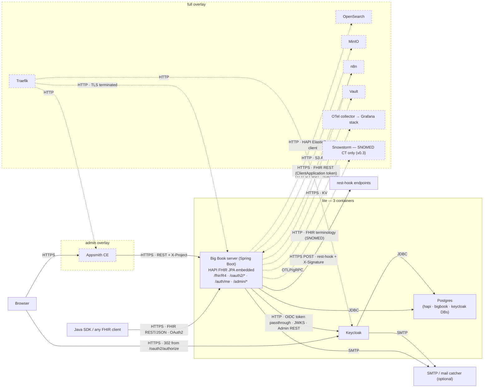
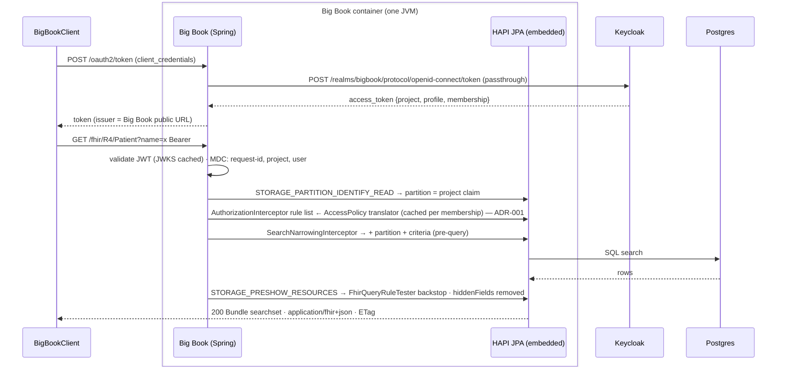
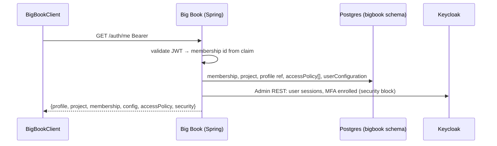
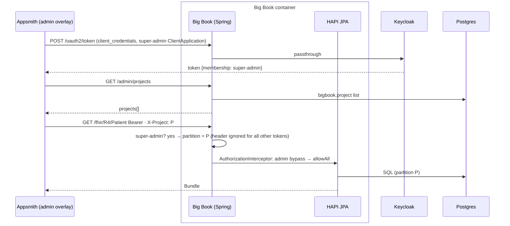

# Big Book — Architecture

> One page. Last artefact before development. Everything here is already decided in `BIGBOOK.md`, `REQUIREMENTS.md` (v0.1 blessed, reconciled 2026-09-17) or ADR-001/002/003/004/006 (HAPI JPA embedded in the Big Book server; `lite` = three containers; no event bus). Status: **current** (inventory reconcile 2026-09-17: §2(a) post-write check, §2(c) delivery table, §3 glue tally). If code and this file disagree, code wins — then fix this file.

## 1. Components — `lite`, with `full` and `admin` overlays dashed



Container count: `lite` 3 · `+admin` 4 · `full` 3 + up to 7. No event bus in either profile (ADR-002, decided 2026-09-17): subscription delivery and cron run on a Postgres table inside the Big Book JVM.

## 2. Request paths

### (a) SDK client-credentials → `/fhir/R4/Patient`



Writes take the same path plus a **two-phase authorisation** (ADR-001, D14): `STORAGE_PRESTORAGE_*` evaluates the policy `criteria` against the incoming resource (phase 1), and `STORAGE_PRECOMMIT_*` re-evaluates it against the stored result inside the transaction (phase 2, rollback + 403 on deny). Phase 2 is what stops a PUT from moving a resource outside its policy. A `criteria` that fails to parse at request time denies (fail closed); a `criteria` outside the evaluable subset is rejected when the `AccessPolicy` or `Subscription` is written (D15).

### (b) `/auth/me`



### (c) Subscription delivery — HAPI matches, Big Book delivers (ADR-002, D55)

HAPI's own delivery queue is an in-memory `LinkedBlockingQueue` and its rest-hook subscriber has no signature, headers, success codes or max attempts, so delivery is Big Book glue on a Postgres table.

```mermaid
sequenceDiagram
  participant C as Client
  box Big Book container (one JVM)
    participant HAPI as HAPI JPA (matcher + registry)
    participant BB as Big Book delivery
  end
  participant PG as Postgres
  participant H as rest-hook endpoint

  C->>HAPI: POST /fhir/R4/Patient
  HAPI->>HAPI: SubscriptionMatcherInterceptor: criteria (write-time validated), interaction filter, meta.account
  HAPI->>BB: SUBSCRIPTION_RESOURCE_MATCHED
  BB->>BB: author's AccessPolicy permits read? (ADR-001; enforced — Medplum's is a no-op, D57)
  BB->>PG: INSERT subscription_delivery {subscription, resource, versionId, interaction, attempt=0, next_attempt_at=now} — same transaction as the resource
  loop every 1 s
    BB->>PG: SELECT … WHERE status='pending' AND next_attempt_at<=now() FOR UPDATE SKIP LOCKED
    BB->>BB: hiddenFields applied · body = resource JSON (or {} on delete) · X-Signature = hex HMAC-SHA256(body, subscription-secret)
    BB->>H: POST body · X-Signature · X-Medplum-Subscription · X-Medplum-Interaction · channel.header[] (120 s timeout, outbound allow-list)
    H-->>BB: 2xx | failure
    BB->>PG: AuditEvent {type=transmit, source.observer=Subscription/id, outcome 0|4, "Attempt n received status c"} in project partition
    BB->>PG: success → status=done · failure → attempt+1, next_attempt_at = now + min(20 s × 2^(attempt−1) × jitter[0.9,1.1], 8 h); attempt ≥ 4 (or subscription-max-attempts) → status=failed
  end
```

| Column | `bigbook.subscription_delivery` (ADR-002) |
|---|---|
| keys | `id`, `subscription_id`, `project_id` |
| what | `resource_type`, `resource_id`, `version_id`, `interaction` |
| state | `status` (pending/done/failed), `attempt`, `next_attempt_at`, `last_error` |
| auto-disable (v0.2) | `consecutive_failures`, `first_failure_at` — the counter Medplum keeps in a Redis sorted set |

Verify first on #12 (ADR-002 Open): the pinned HAPI's hook order must let this insert **replace** `SubscriptionDeliveryQueue` rather than run beside it (a "no" is a double-delivery bug), and HAPI's rest-hook delivery must be drivable from the poller so the HTTP client, headers and interaction filter stay HAPI's.

Guarantees, stated (BB-R-007.11): at-least-once, unordered; receivers dedupe on (subscription, resource id, versionId). Survives restart; a second JVM in `full` shares the table safely via `SKIP LOCKED`. AuditEvent-per-attempt is BB-R-007.3, blessed (ADR-004 consequence). Retry numbers are Medplum's, pinned (D54). `$resend` re-evaluates criteria and inserts a fresh row.

### (d) Super-admin `X-Project` call from Appsmith



Human attribution is absent in v0.1 (audited to the ClientApplication); v0.2 adds `X-Medplum-On-Behalf-Of` (BB-R-024).

## 3. Module map

| Module | Owns | Depends on | Glue share (v0.1 ≈ 5.1k of 5–10k, reconciled 2026-09-17) |
|---|---|---|---|
| `core/` | Tenant model (Project, ProjectMembership, invite, Keycloak org ↔ HAPI partition), AccessPolicy translator + parameter substitution + two-phase write check + criteria validator, shared types | HAPI structures, Keycloak admin client | ≈2.5k (tenant 1.2k · policy 1.3k) |
| `server/` | Spring Boot app: embedded HAPI JPA, interceptor registration, `/oauth2/*` passthrough + reshaped discovery/logout, `/auth/me`, `/admin/*`, `AccessPolicy` provider, subscription delivery table + poller + signature + AuditEvent (≈150), outbound allow-list (≈40), GraphQL depth/cost limits (≈50), `X-Project`, bootstrap | `core/`, HAPI JPA, Spring Security | ≈1.8k |
| `client/` | `BigBookClient`, auth flows, typed CRUD/search/batch/binary, Spring Boot starter | HAPI generic client | ≈0.8k |
| `bots/` | v0.2 — Camel bot runtime + starter | `core/` | 0 in v0.1 |
| `deploy/` | `compose/lite.yml`, `compose/admin.yml`, `compose/full.yml`, Helm chart, `versions.yaml` | — | not Java; uncounted |
| `app/lowcode/` | Appsmith app JSON, vendored AccessPolicy JSON schema, `SCREENS.md` | Big Book REST | uncounted |

## 4. Boundaries — one row per brick

| Brick | Keycloak | HAPI | Big Book |
|---|---|---|---|
| BB-R-001 Datastore | — | CRUD, history, batch/transaction (always atomic), `$validate`, ref-integrity (default on), UUID ids, no update-as-create (config), terminology `$expand` (V8) | partition identity interceptor |
| BB-R-002 Search | — | all params, chaining, includes, `_filter`, paging, `SUBSETTED` tagging (V9) | `_project`/`_compartment` → partition; page links echo caller params |
| BB-R-003 GraphQL | — | `$graphql`, server-wide introspection toggle | PRESHOW field hiding applies unchanged; enforcing depth/cost limits (≈50) |
| BB-R-004 Auth | login flows, OIDC grants, MFA, brokering, claims mappers, JWKS | — | `/oauth2/*` passthrough, discovery + logout reshape, `/auth/me`, JWT validation filter |
| BB-R-005 Tenancy | organisations, users, confidential clients, required actions | partitions | Project/Membership/invite model, org↔partition map, super-admin bootstrap, `X-Project` |
| BB-R-006 Access policies | — | AuthorizationInterceptor, SearchNarrowingInterceptor, FhirQueryRuleTester, hooks | AccessPolicy translator, hiddenFields, readonlyFields, params, defaults, denial log, `AccessPolicy` provider |
| BB-R-007 Subscriptions | — | matching (`SubscriptionMatcherInterceptor`, registry) | delivery table + 1 s poller, retry/backoff (pinned numbers), interaction-filter extension, author-policy check (enforced), X-Signature, AuditEvent per attempt, `$resend`, outbound allow-list, write-time criteria validation |
| BB-R-008 n8n | — | rest-hook source | recipe + example workflow (`full` only) |
| BB-R-009 Binary | — | binary storage (`lite` DB, `full` MinIO) | — |
| BB-R-010 Notifications | invite/reset/verify/MFA emails | — | Spring Mail config surface |
| BB-R-011 Packaging | realm import | — | compose, Helm, profiles, bootstrap, health, config docs |
| BB-R-012 Java SDK | — | generic client | `BigBookClient`, starter |
| BB-R-013 Admin UI | (v0.2 OIDC via On-Behalf-Of) | — | Appsmith app JSON (`admin` overlay), `X-Project` |
| BB-R-014 Wire-compat | — | paths, media types, ETag, status codes by config | `/auth/me`, OAuth path map; v0.2: Medplum admin types, OperationOutcome ids, 412/400 glue |
| BB-R-015 Observability | — | `X-Request-ID` echo | JSON logs with request/project/user, actuator, OTel (`full`) |

Rule: if a row's Big Book cell grows past what's listed, check HAPI's interceptor/settings surface first.

## 5. Cross-cutting

**Identity propagation (BB-R-015).** Inbound `X-Request-ID` is honoured (HAPI native) or generated at the servlet filter; project id resolves from the token `project` claim at partition identification; user id = token `sub`. All three are set in MDC before any interceptor runs and appear on every JSON log line. Subscription deliveries and their AuditEvents carry the originating request id. In `full`, the OTel trace id is added to the same MDC; Medplum's `X-Trace-Id` is v0.2 glue (ADR-003).

**Config precedence.** Environment variables → Helm `values.yaml` / compose `.env` → defaults in `application.yml`. Every key in `docs/guides/config.md` with its default. Secrets never in values files: `lite` reads them from env or Keycloak client attributes; `full` from Vault.

**Version pinning.** `deploy/versions.yaml` is the single source for every upstream (Postgres, Keycloak, HAPI, Appsmith, and all `full` images) and is consumed by compose, Helm values and the Java build properties. One upgrade cadence; the CI e2e smoke runs the pinned set on `lite` and `lite+admin`.

## 6. Out of scope for this document

Class design, table schemas, Helm chart internals, Appsmith widget layout, CI pipeline definition. Claude Code owns each per issue; ADRs capture anything that changes a decision above.
