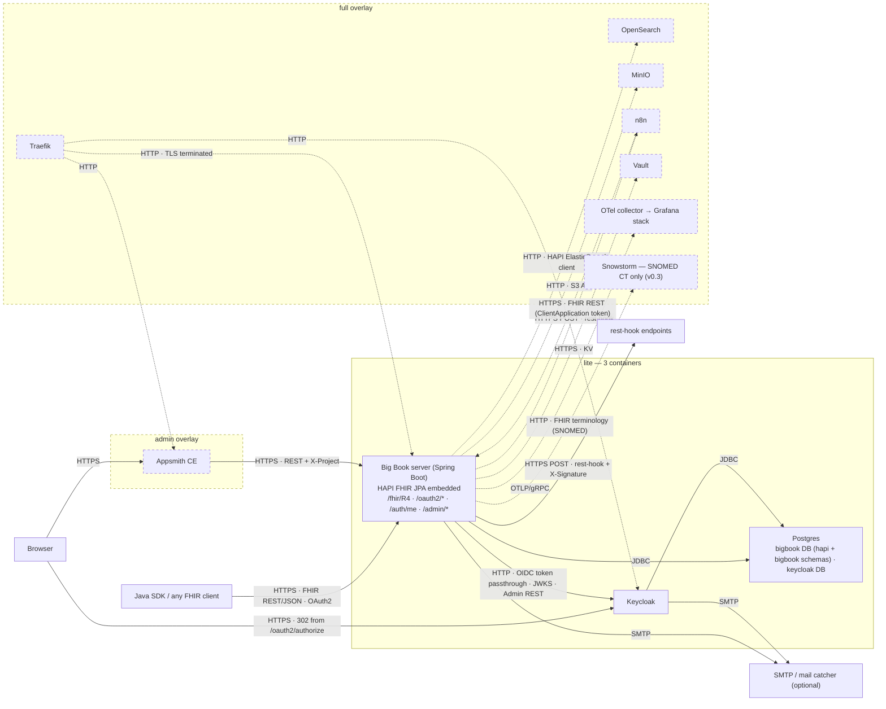
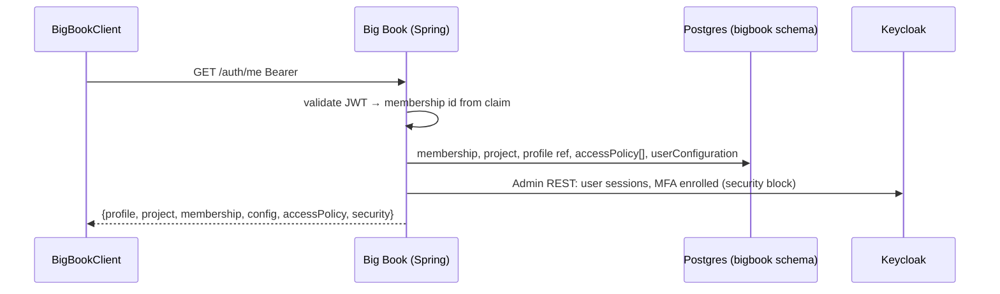
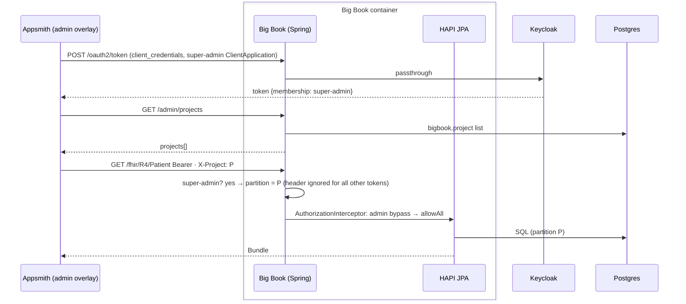

# Big Book — Architecture

> One page. Last artefact before development. Everything here is already decided in `BIGBOOK.md`, `REQUIREMENTS.md` (v0.1 blessed, reconciled 2026-09-17) or ADR-001/002/003/004/006/007 (HAPI JPA embedded in the Big Book server; `lite` = three containers; no event bus; reconcile-never-compensate provisioning). Status: **current** (2026-09-18: §2(e)–(g) create-project, invite, browser login per ADR-007; §3 glue tally 5.5k; §3.1 per-issue estimate added 2026-09-19). If code and this file disagree, code wins — then fix this file.

## 1. Components — `lite`, with `full` and `admin` overlays dashed



Container count: `lite` 3 · `+admin` 4 · `full` 3 + up to 7. No event bus in either profile (ADR-002, decided 2026-09-17): subscription delivery and cron run on a Postgres table inside the Big Book JVM.

## 2. Request paths

### (a) SDK client-credentials → `/fhir/R4/Patient`

```mermaid
sequenceDiagram
  participant SDK as BigBookClient
  box Big Book container (one JVM)
    participant BB as Big Book (Spring)
    participant HAPI as HAPI JPA (embedded)
  end
  participant KC as Keycloak
  participant PG as Postgres

  SDK->>BB: POST /oauth2/token (client_credentials)
  BB->>KC: POST /realms/bigbook/protocol/openid-connect/token (passthrough)
  KC-->>BB: access_token {project, profile, membership}
  BB-->>SDK: token (iss = <base-url>realms/bigbook)

  SDK->>BB: GET /fhir/R4/Patient?name=x  Bearer
  BB->>BB: validate JWT (JWKS cached) · MDC: request-id, project, user
  BB->>HAPI: STORAGE_PARTITION_IDENTIFY_READ → partition = project claim
  BB->>HAPI: STORAGE_PRESEARCH_REGISTERED → SearchParameterMap += compiled criteria (pre-query, every search incl. GraphQL nested)
  BB->>HAPI: AuthorizationInterceptor rule list ← translator (type × interaction, cached per membership) — ADR-001
  HAPI->>PG: SQL search (+ _include / _revinclude joins, unfiltered)
  PG-->>HAPI: rows
  BB->>HAPI: STORAGE_PREACCESS_RESOURCES → drop entries failing criteria (includes, GraphQL refs; primary entries = WARN backstop)
  BB->>HAPI: STORAGE_PRESHOW_RESOURCES → hiddenFields removed
  HAPI-->>SDK: 200 Bundle searchset · application/fhir+json · ETag
```

Writes take the same path plus a **two-phase authorisation** (ADR-001, D14): phase 1 and the `readonlyFields` restore run at `STORAGE_PRESTORAGE_RESOURCE_*` (the existing resource must be inside `criteria`, else 403), and phase 2 runs at `STORAGE_PRECOMMIT_RESOURCE_*` (the committed state must be inside `criteria`, with a `transaction` entry's `urn:uuid` and conditional references already resolved; else 403 and rollback — the whole bundle for a `transaction`, the single entry for a `batch`). ADR-001, amended 2026-09-19. Phase 2 is what stops a PUT from moving a resource outside its policy. A `criteria` that fails to parse at request time denies (fail closed); a `criteria` outside the evaluable subset is rejected when the `AccessPolicy` or `Subscription` is written (D15).

### (b) `/auth/me`



### (c) Subscription delivery — HAPI matches, Big Book delivers (ADR-002, D55)

HAPI's own delivery queue is an in-memory `LinkedBlockingQueue` and its rest-hook subscriber has no signature, headers, success codes or max attempts, so delivery is Big Book glue on a Postgres table.

```mermaid
sequenceDiagram
  participant C as Client
  box Big Book container (one JVM)
    participant HAPI as HAPI JPA (matcher + registry)
    participant BB as Big Book delivery
  end
  participant PG as Postgres
  participant H as rest-hook endpoint

  C->>HAPI: POST /fhir/R4/Patient
  HAPI->>HAPI: SubscriptionMatcherInterceptor: criteria (write-time validated), interaction filter, meta.account
  HAPI->>BB: SUBSCRIPTION_RESOURCE_MATCHED
  BB->>BB: author's AccessPolicy permits read? (ADR-001; enforced — Medplum's is a no-op, D57)
  BB->>PG: INSERT subscription_delivery {subscription, resource, versionId, interaction, attempt=0, next_attempt_at=now} — same transaction as the resource
  loop every 1 s
    BB->>PG: SELECT … WHERE status='pending' AND next_attempt_at<=now() FOR UPDATE SKIP LOCKED
    BB->>BB: hiddenFields applied · body = resource JSON (or {} on delete) · X-Signature = hex HMAC-SHA256(body, subscription-secret)
    BB->>H: POST body · X-Signature · X-Medplum-Subscription · X-Medplum-Interaction · channel.header[] (120 s timeout, outbound allow-list)
    H-->>BB: 2xx | failure
    BB->>PG: AuditEvent {type=transmit, source.observer=Subscription/id, outcome 0|4, "Attempt n received status c"} in project partition
    BB->>PG: success → status=done · failure → attempt+1, next_attempt_at = now + min(20 s × 2^(attempt−1) × jitter[0.9,1.1], 8 h); attempt ≥ 4 (or subscription-max-attempts) → status=failed
  end
```

| Column | `bigbook.subscription_delivery` (ADR-002) |
|---|---|
| keys | `id`, `subscription_id`, `project_id` |
| what | `resource_type`, `resource_id`, `version_id`, `interaction` |
| state | `status` (pending/done/failed), `attempt`, `next_attempt_at`, `last_error` |
| auto-disable (v0.2) | `consecutive_failures`, `first_failure_at` — the counter Medplum keeps in a Redis sorted set |

Verify first on #12 (ADR-002 Open): the pinned HAPI's hook order must let this insert **replace** `SubscriptionDeliveryQueue` rather than run beside it (a "no" is a double-delivery bug), and HAPI's rest-hook delivery must be drivable from the poller so the HTTP client, headers and interaction filter stay HAPI's.

Guarantees, stated (BB-R-007.11): at-least-once, unordered; receivers dedupe on (subscription, resource id, versionId). Survives restart; a second JVM in `full` shares the table safely via `SKIP LOCKED`. AuditEvent-per-attempt is BB-R-007.3, blessed (ADR-004 consequence). Retry numbers are Medplum's, pinned (D54). `$resend` re-evaluates criteria and inserts a fresh row.

### (d) Super-admin `X-Project` call from Appsmith



Human attribution is absent in v0.1 (audited to the ClientApplication); v0.2 adds `X-Medplum-On-Behalf-Of` (BB-R-024).

### (e) Create project — super-admin (`createProject`, HTTP spelling per issue #4)

Narrative: `docs/HOW-IT-WORKS.md` §2–§4. Write order is fixed; failure handling per **ADR-007**.

```mermaid
sequenceDiagram
  participant A as Super-admin (SDK / Appsmith)
  box Big Book container
    participant BB as Big Book (Spring)
    participant HAPI as HAPI JPA
  end
  participant PG as Postgres (bigbook)
  participant KC as Keycloak

  A->>BB: POST /admin/projects {name, settings}  Bearer (super-admin)
  BB->>PG: INSERT project {id=uuid, status=provisioning, settings}  (tx 1)
  BB->>KC: Admin REST: create organisation {alias=id, name}  — idempotent by alias
  KC-->>BB: 201 | 409 (already exists → continue)
  BB->>HAPI: partition create {name=id}  — idempotent by name
  HAPI->>PG: INSERT partition (hapi schema)
  BB->>PG: UPDATE project status=active  (tx 2)
  BB-->>A: 201 Project
  Note over BB,PG: failure at any step → OperationOutcome; row stays `provisioning`; retry of the same POST resumes at the failed step; startup reconciler sweeps stragglers — ADR-007
```

Partial failure, worked: Keycloak org created, partition create fails → row `provisioning`, org exists with alias = id. Retry: INSERT is skipped (row present), org create returns 409 and continues, partition create runs, status → `active`. Nothing is deleted. A project in `provisioning` is invisible to non-super-admins (BB-R-005.13).

### (f) Invite user — `POST /admin/projects/:id/invite`

Narrative: `docs/HOW-IT-WORKS.md` §2–§4. Same pattern as (e); membership row is the anchor.

```mermaid
sequenceDiagram
  participant A as Project admin
  box Big Book container
    participant BB as Big Book (Spring)
    participant HAPI as HAPI JPA
  end
  participant PG as Postgres (bigbook)
  participant KC as Keycloak
  participant M as SMTP

  A->>BB: POST /admin/projects/:id/invite {resourceType, email, scope, membership{admin, access[]}, mfaRequired}
  BB->>BB: policy: caller is admin of :id or super-admin
  BB->>PG: INSERT project_membership {id, project, status=provisioning, admin, access[]}  (tx 1)
  BB->>KC: Admin REST: find user by email; create if absent (scope=server: realm user; scope=project: org-bound) — idempotent
  BB->>KC: add user to organisation :id; set required action MFA if mfaRequired
  BB->>HAPI: conditional create Practitioner|Patient|RelatedPerson ?identifier=email (partition :id)
  HAPI->>PG: INSERT resource (hapi schema, partition :id)
  BB->>PG: UPDATE membership {profile=Type/id, user=kc-sub, status=active}  (tx 2)
  BB->>KC: Admin REST: execute-actions-email (set password / verify)
  KC->>M: invite email
  BB-->>A: 200 ProjectMembership
  Note over BB,KC: email failure after tx 2 → 200 with warning OperationOutcome (Medplum behaviour, inventory T5); everything before tx 2 → ADR-007
```

`ClientApplication` (`…/client`) follows the same order with a Keycloak confidential client instead of a user and no email; the secret is readable on the resource (ADR-004, inventory D5).

### (g) Browser authorization-code login — predecessor to (b)

Narrative: `docs/HOW-IT-WORKS.md` §2. No Big Book UI is involved; Keycloak renders every page.

```mermaid
sequenceDiagram
  participant U as Browser
  participant APP as App (any OIDC client / SDK signInWithRedirect)
  participant BB as Big Book (Spring)
  participant KC as Keycloak

  U->>APP: open app
  APP->>BB: GET /oauth2/authorize?response_type=code&client_id&redirect_uri&scope=openid profile organization:<project>&code_challenge (S256)
  BB-->>U: 302 → /realms/bigbook/protocol/openid-connect/auth?… (path rewrite, params passthrough)
  U->>KC: login page: password | brokered IdP | MFA required action
  Note over KC: multi-organisation user without organization:<alias> → Keycloak organisation selection (wire Keycloak; verify-first on issue #5)
  KC-->>U: 302 → redirect_uri?code&state
  U->>APP: code
  APP->>BB: POST /oauth2/token grant_type=authorization_code&code&code_verifier&client_id (public client)
  BB->>KC: passthrough
  KC-->>BB: access_token {sub, profile, organization=project, login_id←sid (v0.2), client_id←azp (v0.2)} + refresh_token
  BB-->>APP: tokens — v0.1 as-is; v0.2 body enriched with project + profile (ADR-003, inventory D3)
  APP->>BB: GET /auth/me  Bearer  → §2(b)
```

Issuer = `<BIGBOOK_BASE_URL>realms/bigbook`: Keycloak `hostname` is set to Big Book's public URL and Keycloak appends `/realms/<realm>` (ADR-003). Discovery advertises the same string.

**Keycloak's pages come through Big Book (ADR-003, 2026-09-19).** With the hostname pinned, every URL Keycloak emits — the login form's `action`, its redirects, its CSS and JS — is on Big Book's origin, so Big Book proxies two prefixes and nothing else. **Allow-list, the two positive prefixes only:** `/realms/<realm>/` (realm name fixed from config, never `/realms/master`, never a path parameter) and `/resources/`. Everything else on Keycloak's origin is **404 at Big Book**: `/admin/**`, `/realms/master/**`, `/metrics`, `/health`. Big Book's own Admin REST calls use the internal container address, never the proxy. `/realms/<realm>/account/**` is inside the allow-list and stays reachable — user-scoped, not admin. Proxy rules: forward `X-Forwarded-Host`/`-Proto`/`-Port` (`KC_PROXY_HEADERS=xforwarded`), pass `Set-Cookie` and 302 through unchanged, never follow redirects, stream bodies. `lite` publishes only Big Book's port; the admin console is reached via `KC_HOSTNAME_ADMIN` on an operator-only address (BB-R-011.9). In `full` the same prefixes route through Big Book, not Traefik→Keycloak. Logout: `POST /oauth2/logout` Bearer → Big Book → Keycloak Admin REST session delete (re-shaped, ADR-003).

Verify-first (issue #5, wire not glue): (1) `organization:<alias>` scope binds the token to one organisation; (2) bare `organization` scope triggers the built-in organisation selector for multi-org users. If (2) is absent, project selection at login becomes a Big Book step — raised as a proposed ADR-008, not worked around.

## 3. Module map

| Module | Owns | Depends on | Glue share (v0.1 ≈ 5.5k estimated of 5–10k, 2026-09-18; ADR-001 1.4–1.6k) |
|---|---|---|---|
| `core/` | Tenant model (Project, ProjectMembership, invite, Keycloak org ↔ HAPI partition, `provisioning` status + startup reconciler ≈60 — ADR-007), AccessPolicy translator + parameter substitution + two-phase write check + criteria validator, shared types | HAPI structures, Keycloak admin client | ≈2.9k (tenant 1.3k · policy 1.4–1.6k, ADR-001 amended) |
| `server/` | Spring Boot app: embedded HAPI JPA, interceptor registration, `/oauth2/*` passthrough + reshaped discovery/logout, `/auth/me`, `/admin/*`, `AccessPolicy` provider, subscription delivery table + poller + signature + AuditEvent (≈150), outbound allow-list (≈40), GraphQL depth/cost limits (≈50), `X-Project`, bootstrap | `core/`, HAPI JPA, Spring Security | ≈1.8k |
| `client/` | `BigBookClient`, auth flows, typed CRUD/search/batch/binary, Spring Boot starter | HAPI generic client | ≈0.8k |
| `bots/` | v0.2 — Camel bot runtime + starter | `core/` | 0 in v0.1 |
| `deploy/` | `compose/lite.yml`, `compose/admin.yml`, `compose/full.yml`, Helm chart, `versions.env` | — | not Java; uncounted |
| `app/lowcode/` | Appsmith app JSON, vendored AccessPolicy JSON schema, `SCREENS.md` | Big Book REST | uncounted |

### 3.1 Per-issue glue estimate

What CONTRIBUTING §4 compares a PR against: *if an issue's actual exceeds its share here, the PR stops for a decision.* Derived from the §3 module shares and the ADR budgets. **Source** says where a number comes from; **(g)** marks a split nobody has decided, made so that each module's rows add up to its §3 share. A guessed figure is a tripwire, not a target: crossing it starts a conversation. **Module shares are indicative; the total and the per-issue rows are what the CONTRIBUTING §4 rule tests against.** Lines are main Java only; tests, SQL, YAML and shell are uncounted. Replace an estimate with the actual when the issue merges.

| Issue | `core/` tenant | `core/` policy | `server/` | `client/` | Total | Source |
|---|---|---|---|---|---|---|
| #2 `lite` skeleton | — | — | **237 actual** | — | **237 actual** | PR #23 |
| #3 bootstrap | **182 actual** | — | **152 actual** | — | **334 actual** | PR #25 |
| #4 tenant model | **205 actual** | — | **501 actual**: token validation and project resolution 172 (moved here from #5, 2026-09-19), partition identity and `_project`/`_compartment` 80, project routes 187, `OperationOutcome` writer 37, wiring 25 | — | **706 actual** | PR for #4. Estimate was ≈950 + the lines moved from #5, so the issue is inside its share; but the (g) split was wrong about *where*: ≈750 was guessed for `core/` and ≈200 for `server/`. Reconciler is 25 lines, not ≈60. Not built here, so not yet counted: `Project.owner` and user-scope rules (arrive with #6's member routes) |
| #5 auth surface | — | — | ≈310 (g) | — | ≈310 | remainder of `server/`, less the 172 lines of token validation and project resolution that #4 took (decided 2026-09-19), plus **30 for the Keycloak login/asset proxy** (ADR-003, 2026-09-19). Keeps `/oauth2/*` passthrough, reshaped endpoints, `/auth/me`, remaining claim mappers |
| #6 invite, client routes | ≈370 (g) | — | ≈200 (g) | — | ≈570 | ADR-007 same pattern as #4; split (g) |
| #7 access policy | — | 1.4–1.6k | ≈150 `AccessPolicy` provider and wiring (g) | — | ≈1.55–1.75k | ADR-001 line items: translator 400, `PRESEARCH` 120, `PREACCESS` 150, `hiddenFields` 150, `readonlyFields` 100, post-write 50, write-time validation 60, params 100, interaction split 60, subscriptions 100, denial log 50, backstop 20 = 1,360, + extras ≤200. **Ceiling 1.6k on `core/policy`** (issue #7). The provider is listed under `server/` in §3 and is not in ADR-001's items |
| #8 datastore config | — | — | **181 actual**: conditional-update compat filter 108, interim operation deny 48 (removed by #7), HAPI config 25 | — | **181 actual** | wire + compat filter. Accepted against `server/` by the maintainer at 132; the interim `$expunge`/`$reindex`/`$get-resource-counts`/`hapi.fhir.*` deny added afterwards on the same instruction brings it to 181. 48 of those lines leave with #7 |
| #9 search | — | — | ≈50 `_project` / `_compartment` → partition (g) | — | ≈50 | "glue, small" (issue #9, T26) |
| #10 GraphQL | — | — | ≈50 | — | ≈50 | BB-R-003: 40–60 |
| #12 subscriptions | — | — | ≈210: delivery ≈150 (ADR-002), interaction filter ≈20 (BB-R-007), allow-list ≈40 | — | ≈210 | ADR-002; policy-side enforcement ≈100 is in #7's budget |
| #15 Java SDK | — | — | — | ≈800 | ≈800 | §3 |
| #17 observability | — | — | ≈100 MDC, JSON log fields (g) | — | ≈100 | remainder of `server/` |
| **Module total** | **≈1.3k** | **1.4–1.6k** | **≈1.8k** | **≈0.8k** | **≈5.3–5.5k** | §3 |

**Module drift after #4 (2026-09-19):** with #2–#4 as actuals and the rest as estimated, `server/` adds up to ≈1.93k against its 1.8k share, and `core/` tenant to ≈0.76k against 1.3k. The total is unchanged; the tenant model turned out to be mostly request handling (`server/`) and little domain code (`core/`). Decided 2026-09-19: module shares are indicative, so §3 is not rebalanced and this drift stops no PR.

Wire-only issues (#8, #11, #13, #14, #16, #18, #22) carry no glue share; glue appearing in one of them is new scope (`docs/BIGBOOK.md`: it needs a matching removal).

## 4. Boundaries — one row per brick

| Brick | Keycloak | HAPI | Big Book |
|---|---|---|---|
| BB-R-001 Datastore | — | CRUD, history, batch/transaction (always atomic), `$validate`, ref-integrity (default on), UUID ids, no update-as-create (config), terminology `$expand` (V8) | partition identity interceptor |
| BB-R-002 Search | — | all params, chaining, includes, `_filter`, paging, `SUBSETTED` tagging (V9) | `_project`/`_compartment` → partition; page links echo caller params |
| BB-R-003 GraphQL | — | `$graphql`, server-wide introspection toggle | PRESHOW field hiding applies unchanged; enforcing depth/cost limits (≈50) |
| BB-R-004 Auth | login flows, OIDC grants, MFA, brokering, claims mappers, JWKS | — | `/oauth2/*` passthrough, discovery + logout reshape, `/auth/me`, JWT validation filter |
| BB-R-005 Tenancy | organisations, users, confidential clients, required actions | partitions | Project/Membership/invite model, org↔partition map, super-admin bootstrap, `X-Project`, `provisioning` anchor rows + reconciler (ADR-007) |
| BB-R-006 Access policies | — | AuthorizationInterceptor, PRESEARCH/PREACCESS/PRESHOW/PRESTORAGE/PRECOMMIT hooks, InMemoryResourceMatcher | AccessPolicy translator, hiddenFields, readonlyFields, params, defaults, denial log, `AccessPolicy` provider |
| BB-R-007 Subscriptions | — | matching (`SubscriptionMatcherInterceptor`, registry) | delivery table + 1 s poller, retry/backoff (pinned numbers), interaction-filter extension, author-policy check (enforced), X-Signature, AuditEvent per attempt, `$resend`, outbound allow-list, write-time criteria validation |
| BB-R-008 n8n | — | rest-hook source | recipe + example workflow (`full` only) |
| BB-R-009 Binary | — | binary storage (`lite` DB, `full` MinIO) | — |
| BB-R-010 Notifications | invite/reset/verify/MFA emails | — | Spring Mail config surface |
| BB-R-011 Packaging | realm import | — | compose, Helm, profiles, bootstrap, health, config docs |
| BB-R-012 Java SDK | — | generic client | `BigBookClient`, starter |
| BB-R-013 Admin UI | (v0.2 OIDC via On-Behalf-Of) | — | Appsmith app JSON (`admin` overlay), `X-Project` |
| BB-R-014 Wire-compat | — | paths, media types, ETag, status codes by config | `/auth/me`, OAuth path map; v0.2: Medplum admin types, OperationOutcome ids, 412/400 glue |
| BB-R-015 Observability | — | `X-Request-ID` echo | JSON logs with request/project/user, actuator, OTel (`full`) |

Rule: if a row's Big Book cell grows past what's listed, check HAPI's interceptor/settings surface first.

## 5. Cross-cutting

**Identity propagation (BB-R-015).** Inbound `X-Request-ID` is honoured (HAPI native) or generated at the servlet filter; project id resolves from the token `project` claim at partition identification; user id = token `sub`. All three are set in MDC before any interceptor runs and appear on every JSON log line. Subscription deliveries and their AuditEvents carry the originating request id. In `full`, the OTel trace id is added to the same MDC; Medplum's `X-Trace-Id` is v0.2 glue (ADR-003).

**Config precedence.** Environment variables → Helm `values.yaml` / compose `.env` → defaults in `application.yml`. Every key in `docs/guides/config.md` with its default. Secrets never in values files: `lite` reads them from env or Keycloak client attributes; `full` from Vault.

**Version pinning.** `deploy/versions.env` is the single source for every upstream (Postgres, Keycloak, HAPI, Appsmith, and all `full` images) and is consumed by compose, Helm values and the Java build properties. One upgrade cadence; the CI e2e smoke runs the pinned set on `lite` and `lite+admin`.

## 6. Out of scope for this document

Class design, table schemas, Helm chart internals, Appsmith widget layout, CI pipeline definition. Claude Code owns each per issue; ADRs capture anything that changes a decision above.
